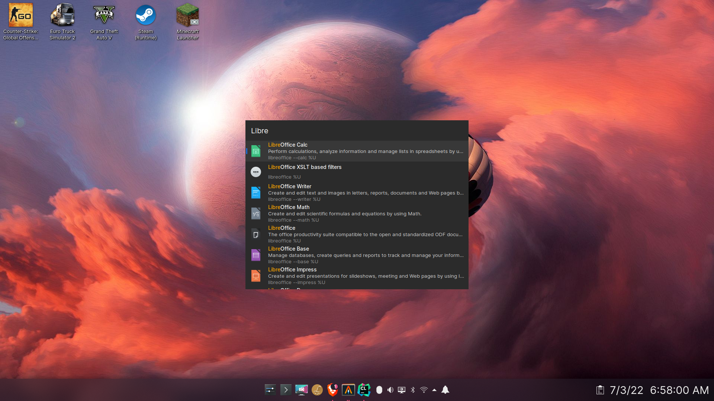
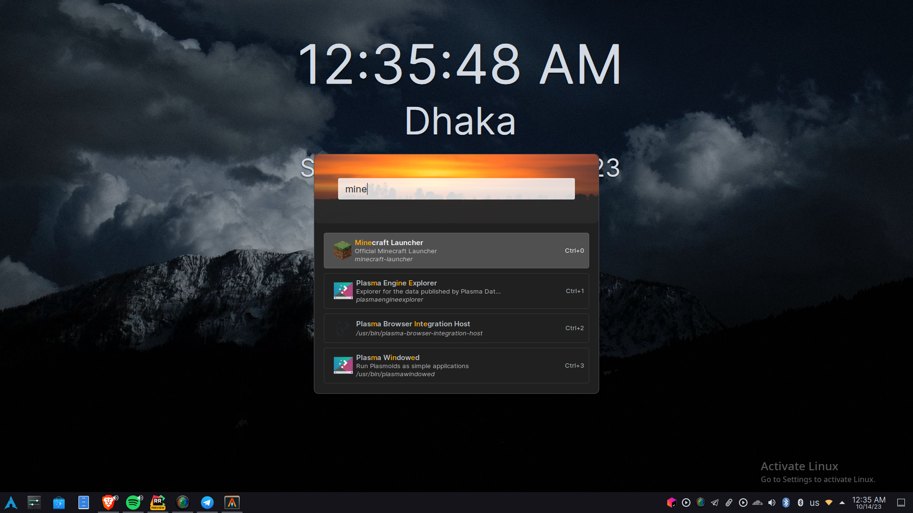

# Findex

Findex is a highly customizable application launcher written in Rust and uses GTK3

## Quick Note

The tyranny of Israel on the Palestinian people is horrifying and heartbreaking. As such, we all
should try our best to support them from our position. Consider supporting the Palestinians
by donating to the [Palestinian Red Crescent Society](https://www.palestinercs.org/en/Donation).

Banner from: https://github.com/Safouene1/support-palestine-banner/

## Features

- Customization using CSS
- Plugin system
- Custom shortcut for triggering plugins
- Shortcut for executing each result(upto 10)

## Installation

Check [INSTALLATION.md](./INSTALLATION.md)

## Plugins

Check [Plugins Guide](crates/findex-plugin/README.md)

## Customization

Check [CUSTOMIZATION.md](./CUSTOMIZATION.md)

Example customization:

Themes: Breeze Light (Plasma), darknord-gtk-theme (GTK2/3)

Icons: breeze (Plasma), breeze (GTK2/3)

Configuration: [Configuration files link](https://gist.github.com/mdgaziur/1d31a5db4b76693db614f553c0b036f0)

## Reporting Bugs
If you find any bugs, please create an issue and include the latest log from `~/.findex-logs`.
